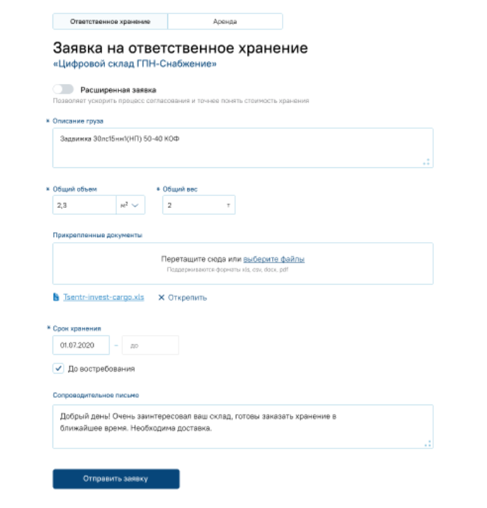

## Тестовое задание

## User story

Общая постановка: Добавление заявки на ответственное хранение в базу данных.  
Ожидаемый результат: Заявка добавлена в базу, ошибки корректно обработаны. На бэке один метод по REST.  
Макет фронта:  

**Уточнения и предположения**

* Хранение файлов осуществляется общим сервисом common_files с базовым набором методов:
  * Сохранить файл
  * Удалить файл
  * Получить файл
  * получить имена файлов по идентификаторам
  * и.т.д.
* Авторизация пользователя происходит с получением токена, который содержит базовые атрибуты пользователя:
  * user_uuid - идентификатор пользователя контрагента
  * user_role - пользовательская роль
  * contractor_uuid - идентификатор контрагента
  * contractor_role - роль контрагента

* "Расширенная заявка" содержит дополнительные поля, которые не реализуются в рамках данной постановки
* Основная единица хранения объема - литры.
* Форма "Ответсвенное хранение" и "Аренда" отличаются по набору полей и заявки сохраняются разными методами.

## Поставленные задачи для разработчиков:

1. `[back]` Добавить таблицу orders в схеме storage. Описание таблицы: [orders.sql]
2. `[back]` Создать метод "Создание заявки" в сервисе order-crud в соответсвии с описанием:
   * Описание метода [Создание заявки]
   * Схема: [OpenApi]
3. `[front]` Отрисовать форму "Создание заявки" и подключить к методам бэка:
   * [Макет формы](image.png)
   * [readme](Постановка%20Front/readme.md#Описание-фронта)

[orders.sql]: /TestExam/orders.sql
[Создание заявки]: /TestExam/Постановка%20Back/readme.md#Создание-заявки
[OpenApi]: /TestExam/OpenAPI.yaml